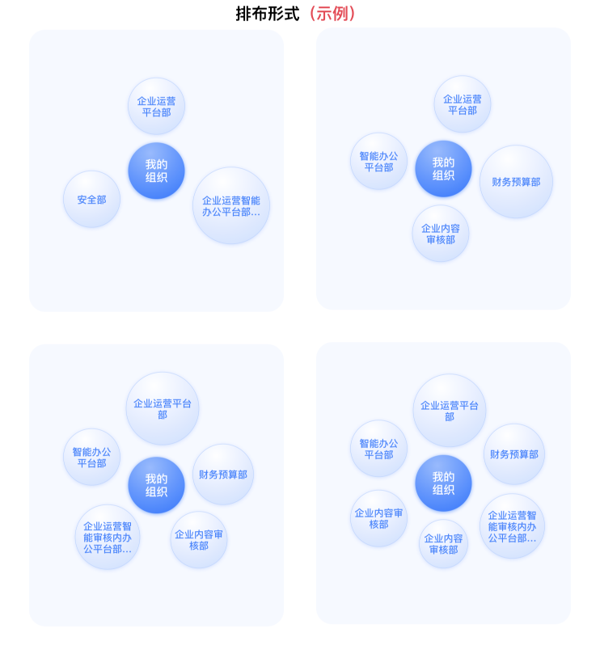
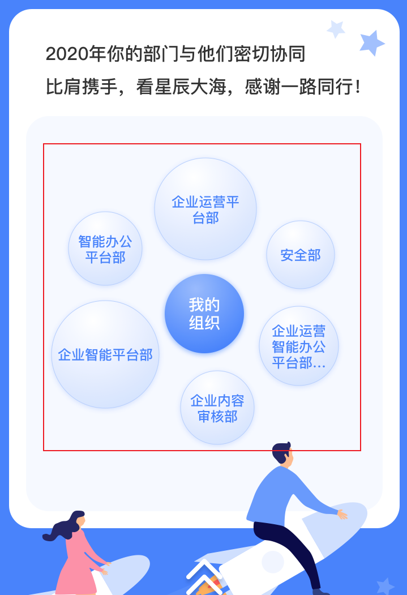
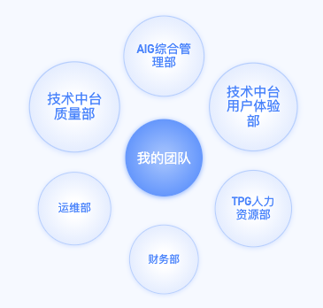
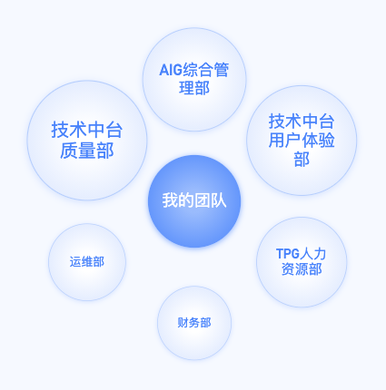
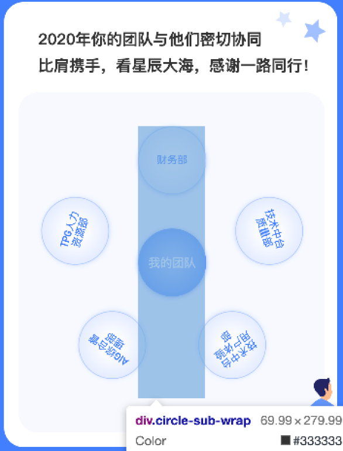

# 人效统计项目的气泡图思路和实现

## 需求

如下, 有一个中心元素, 其周围有 3~6 个元素, 按各自权重呈现不同的大小, 称为气泡图.




调研了市面上常见图表库, 没有类似场景的示例.

## 思路

马上想到, 周围元素相对于中心平移, 形成规则的三/四/五/六边形, 再根据处理后的权重进行缩放.

## 细节

### 1. 单个气泡及文字内容

首先完成单个的气泡, 期望在一定缩放范围内, 内部文字都能完整协调地展示.  
考虑到浏览器的最小字号特性, 且业务上文字长度最大为 12, 最终:

- 容器元素用 `border-radius` 处理为圆形, 内部元素按百分比绝对定位, 呈现为圆形中心的最大正方形
- 内部的文字内容水平垂直居中;
- 先设置容器整体的尺寸, 使文字长度最大时仍不会溢出, 再按设计稿对其缩放

此时即为中心元素和原始大小的周围元素的样式

```scss
.circle {
  // ...
  position: absolute;
  border-radius: 50%;

  .square {
    // ...
    position: absolute;
    $margin-to-circle: 15%;
    top: $margin-to-circle;
    right: $margin-to-circle;
    bottom: $margin-to-circle;
    left: $margin-to-circle;
  }
}
```

### 2. 整体布局

- 所有气泡初始都绝对定位在中心
- js 根据周围气泡的数量(3~6)设置容器类, css 平移得到整体上规则的形状
- 再打乱下排序, 不完全在顺时针上降序

```scss
.bubble-chart {
  $size: 210px;

  &.triangle {
    .circle.sub:nth-of-type(4) {
      transform: translateX(0px) translateY(-$size);
    }

    .circle.sub:nth-of-type(2) {
      transform: translateX(.88 * $size) translateY(.5 * $size);
    }

    .circle.sub:nth-of-type(3) {
      transform: translateX(-.88 * $size) translateY(.5 * $size);
    }

    .circle.sub:nth-of-type(5),
    .circle.sub:nth-of-type(6),
    .circle.sub:nth-of-type(7) {
      display: none;
    }
  }

  &.square {
    // ...
  }

  &.pentagon {
    // ...
  }

  &.hexagon {
    .circle.sub:nth-of-type(2) {
      transform: translateX(-.88 * $size) translateY(-.5 * $size);
    }

    .circle.sub:nth-of-type(4) {
      transform: translateX(0px) translateY(-$size);
    }

    .circle.sub:nth-of-type(3) {
      transform: translateX(.88 * $size) translateY(-.5 * $size);
    }

    .circle.sub:nth-of-type(5) {
      transform: translateX(.88 * $size) translateY(.5 * $size);
    }

    .circle.sub:nth-of-type(7) {
      transform: translateX(0px) translateY($size);
    }

    .circle.sub:nth-of-type(6) {
      transform: translateX(-.88 * $size) translateY(.5 * $size);
    }
  }
}
```

### 3. 气泡的缩放

数据结构如下, 是递减的:

```json
{
  "coordination": {
    "orgNameRank1": "技术中台质量部",
    "weight1": 1.84861614903053,
    "orgNameRank2": "技术中台用户体验部",
    "weight2": 1.68955126443489,
    "orgNameRank3": "AIG综合管理部",
    "weight3": 1.66691738742104,
    "orgNameRank4": "TPG人力资源部",
    "weight4": 1.6437778309971,
    "orgNameRank5": "运维部",
    "weight5": 1.62436690549733,
    "orgNameRank6": "财务部",
    "weight6": 1.60143930010733
  }
}
```

权重的取值范围很大. 由于气泡大小描述的是**气泡之间的关系**, 先处理他们为每项相对于总和的平均数:

```js
let weights = ["1.101", "1.006", "0.993", "0.979", "0.967", "0.953"]
```

上面情况的数据可以直接作为缩放比(即 `transform: scale` 的值), 但最大/最小项超过 1.3 / 0.8 (设计图上的最大/最小缩放比)时,
会非常不协调:

```js
let weights = ["1.537", "1.317", "1.171", "0.878", "0.585", "0.512"]
```


问题来了, 怎样把上述情况转换为合理的缩放比呢?

#### 3.1 抹平增减趋势

自己的方案是: 当缩放比超过设计的极值时, 抹平整个数组的增减趋势, 不让首项/末项超过极值. 以首项为例:

1. 首项 `largest` > 1.3 时, 减小为 1.3, 并计算出减小的因数 largerBy = `(largest - 1.3) / (largest - 1)`
2. 遍历, 将值大于 1 的项 `val` 处理为 `val - ((val - 1) * largerBy)`

末项 `smallest` < 0.8 时, 相应地有 smallerBy = `(0.8 - smallest) / (1 - smallest)`, 其余操作类似.

这样在尽量维持增减趋势的同时, 避免了过大/过小的缩放, 算是解决了问题:



#### 3.2 固定最大/最小缩放比

提测后, pm 观察上面方案用于大多数数据时, 不足以体现出气泡大小的区别:

> 总监的数据, 这几个泡泡看不出来差别呢

那怎样看出差别呢? 快速和 pm 确认, 让首项总是 1.3, 末项总是 0.8, 这样就差别明显了.  
不评价这个方案, 实现为:

1. 计算出各项之间的差, 相对于首项/末项差的占比 `weightOfDiff`
2. 声明新的缩放比数组, 首项为 1.3, 之后按 `weightOfDiff * (1.3 - 0.8)` 递减, 末项总为 0.8



## 新思路

后续思考, 有更语义化和易于维护的思路:

1. 周围元素共 n 个, 将每一个放置在'长条'容器内的顶部, 容器中心为中心元素的位置
2. 处理每个容器, 计算第 i 个的旋转角度 `degree = 360 / n * i`,
3. 设置容器 `transform: rotate(${degree}deg)`, 此时:



4. 对容器内部的文字元素设置 `transform: rotate(${-degree}deg)` 恢复到水平位置

旋转长条容器而不是气泡, 原因是:  
前者默认的 `transform-origin` 是默认的 `center`, 即中心元素; 否则还要单独处理后者的 `transform-origin`.    
上述逻辑可以用 sass 的函数实现, 个人认为 js 处理更易于维护


