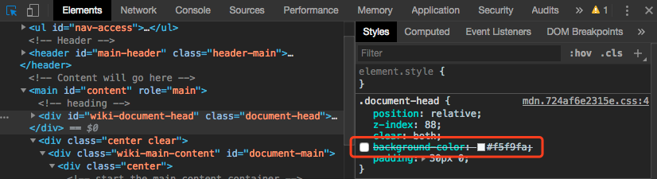
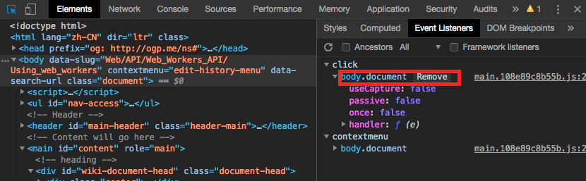
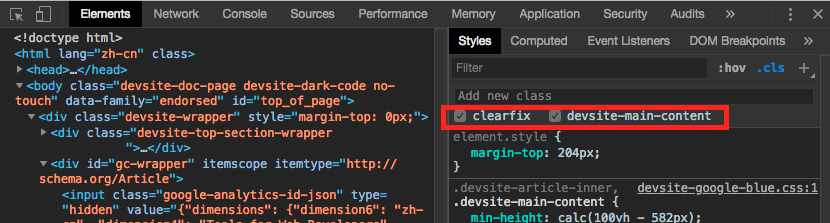
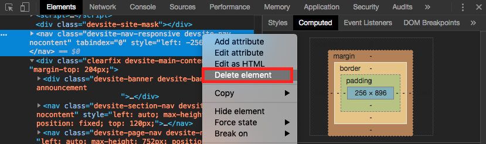
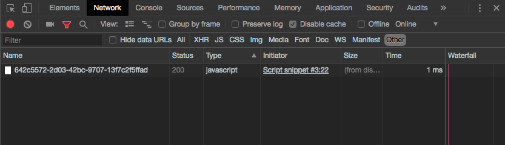
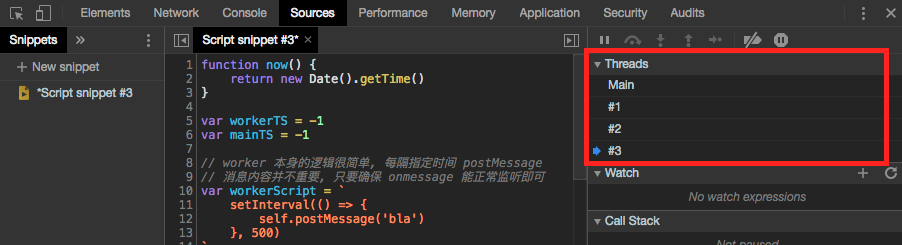

# 前端添加水印和基于 Web Worker 的防篡改

## 需求

为了预防用户截图造成信息泄露的情况, 在页面的指定区域展示水印, 具体内容为当前登录者用户名的 hash.  
在前端**尽可能**防止用户对该水印的修改.

## 初步思路

1. 通过以下两种方式拿到水印图片的 url:

- 通过接口直接获取(普通的 `src` 或 `base64` 编码均可)
- 通过接口获取用户名的 hash 字符串, 画到一个 `<canvas>` 里, 再用 `toDataURL()` 将其转化为 `base64` 的 url

2. 如果目标元素比较单一, 直接设置它的 `background-image` 属性为上面拿到的 url
3. 如果目标区域有**重叠的多个元素**, 可以在其上面放置一个透明的浮层元素, 设置它的 `background-image` 属性为上面拿到的
   url;  
   同时设置其 `pointer-events` 为 `none`, 使鼠标事件能够"穿透"此浮层, 被下面的目标区域的元素捕获

## 在前端"添加水印"?

看起来需求达到了, 但接下来的问题还有很多.

通过现代浏览器的开发者工具可以对任一 DOM 元素进行以下操作:

1. 修改它的任一所属选择器的样式



2. 禁用它的指定事件监听



3. 修改它的行内样式 / 类名



4. 将其直接移出 DOM 树



所以, 要达到**完全**防止篡改的目的, 只有后端处理图片并写入水印, 由前端展示这张图片. 任何通过修改 DOM 元素样式达到这种"
水印"的思路都不能万无一失.

好在我们的项目是对内的, 用户基数也比较少, 这里的水印一定程度上只是起到震慑用户不要泄露信息的作用.  
所以发散一下前端**尽量**防止篡改的技术思路.

## 一个做的不错但还能改进的例子

请看这个[示例](https://orgtree.baidu-int.com/orgtree/r#/?r=true), 该页面在 `<body>` 上设置了水印的 url 作为背景图片. 打开
devtool
后我们移除掉这个 `background-image` 行内样式, 会发现很快又恢复原状了.  
不错不错! 那么有什么破解的方法么.

猜测有可能是设置了定时器导致了该属性在修改后恢复:

```js
setInterval(function () {
  document.body.style.backgroundImage = '...'
}, 500)
```

`setInterval` 是 window 的方法, 其返回一个从 1 开始并随每次调用递增的 `intervalId`, 在清除计时器时作为唯一标识.
因此在控制台中执行:

```js 
let lastIntervalId = setInterval(function () {
}, 10)
console.log(lastIntervalId) // 12
``` 

得知当前 window 下有至少 12 个计时器. 扩大一点范围, 将他们清除掉:

```js 
for (let i = 0; i < 20; i++) {
  clearInterval(i)
}
``` 

再删除一次行内的 `background-image`, 水印已经消失了. 所以这种 devtool 内的篡改的防范有哪些思路呢?

## 思路一: 在 `iframe` 里 `setInterval`, 重设水印元素和样式

首先尝试在页面内嵌入一个不可见的 `iframe`, 它只包含一段脚本, 内容是每隔一段时间向父窗体 postMessage,
通知其重设目标水印所在的元素和具体样式. 但这个思路的漏洞也很多.

通过 chrome devtool
的[执行环境选择器](https://developers.google.com/web/tools/chrome-devtools/console/#execution-context)可以选择当前
console 所在的 JavaScript 上下文, 用于查看指定执行环境的日志 / 修改其成员等.

可选的上下文包括但不限于:

1. 页面内嵌的 `iframe`
2. 当前已安装的 Chrome 扩展
3. 嵌入式的 web worker

只需进入 iframe 的上下文, 再执行上述的清除计时器操作就可以了. 甚至还可以更简单地直接把这个 iframe 移出 DOM 树,
也能达到篡改的目的.

## 思路二: 观察目标水印元素节点的变动

之后尝试观察**目标节点的样式属性**以及**目标节点父节点的子元素**等, 在行内样式改变或节点被移除时得到通知, 恢复它们.  
有以下两种思路:

1. 分别通过 `DOMAttrModified` 和 `DOMNodeRemoved` 事件监听它们. 这种方式缺点很多, 一是如前所述, DOM 元素的任何监听事件都能通过
   devtool 禁用;
   二是这套 [Mutation 事件](https://developer.mozilla.org/en-US/docs/Web/Guide/Events/Mutation_events)有很大的性能问题,
   已经快废弃了.
2. 通过 [MutationObserver](https://developer.mozilla.org/zh-CN/docs/Web/API/MutationObserver) 监听, 注意 IE 10
   及以下版本需要使用 [polyfill](https://github.com/megawac/MutationObserver.js).

## 思路三: 在独立的 web worker 内 setInterval

### 1. worker 简介

web worker 用于产生独立于 UI 渲染的后台线程, 一般用于执行较复杂的计算任务等, 不会阻塞和干扰用户界面的渲染.  
和父子窗体类似, worker 和主线程之间用 `postMessage()` 发送消息, 用 `onmessage` 事件处理函数来响应消息.  
构造器语法如下:

```js
// scriptURL 为一个同源的 js url, 必填
let worker = new Worker(scriptURL)
```

### 2. 思路

方便起见, 我们使用 HTML5 的 `Blob` 接口, 用"数据块"的形式获取一个 js url:

```js
// 可以在 chrome 的 snippets 里直接编辑
let workerScript = `
  setInterval(() => {
    // worker 内禁止操作父页面的节点以及使用父页面中的对象, 必须使用 postMessage 通信
    self.postMessage('RESET WATERMARK')
  }, 500)
`

let blob = new Blob(
    [workerScript],
    {type: 'application/javascript'}
)

let worker = new Worker(
    window.URL.createObjectURL(blob)
)

worker.onmessage = function () {
  // 判断消息内容, 重置节点
  document.body.style.backgroundColor = 'black'
}
```

详见 [Worker](https://developer.mozilla.org/zh-CN/docs/Web/API/Web_Workers_API/Using_web_workers#%E5%B5%8C%E5%85%A5%E5%BC%8F_worker)
和 [Blob](https://developer.mozilla.org/zh-CN/docs/Web/API/Blob).  
这种方式产生的 JavaScript 资源会出现在 `Network -> Other` 而不是 `Network -> JS` 内, 并且不会以 `<script>` 标签的形式体现在
DOM 树中, 降低了篡改的可能.



### 3. 问题

如前所述, 通过[执行环境选择器](https://developers.google.com/web/tools/chrome-devtools/console/#execution-context)
可以选择嵌入页面的 web
worker 上下文. 选择之后在 console 里清除一次计时器, 在修改 `<body>` 的背景颜色, 篡改再次成功了.

### 4. 优化

考虑到 chrome console 执行环境的切换一般来说是由手动的点击+选择完成的(**不确定 chrome 是否提供了用于切换的接口**),
我们假设两次**切换执行环境并清除所有计时器**操作的间隔必定大于一定时间(如 800ms)
.  
分别设置主线程和 worker 线程对应的改动时间戳, 除非在 800ms 内两个线程的计时器均被清除, 否则目标元素的样式始终会间隔重置.

代码如下:

```js
function now() {
  return new Date().getTime()
}

let workerTS = -1
let mainTS = -1

// worker 本身的逻辑很简单, 每隔指定时间 postMessage
// 消息内容并不重要, 只要确保 onmessage 能正常监听即可
let workerScript = `
  setInterval(() => {
    self.postMessage('bla')
  }, 500)
`

function checkBackgroundImage() {
  console.log('WATERMARK RESET')
  document.body.style.backgroundColor = 'black'
}

function startWorker() {
  if (now() - workerTS < 800) {
    return
  }
  workerTS = now()
  let blob = new Blob(
      [workerScript],
      {type: 'application/javascript'}
  )
  let worker = new Worker(
      window.URL.createObjectURL(blob)
  )
  worker.onmessage = threadFromWorker
  return worker
}

function startMainInterval() {
  if (now() - mainTS < 800) {
    return
  }
  mainTS = now()
  setInterval(() => {
    threadFromMain()
  }, 500)
}

function threadFromWorker() {
  workerTS = now()
  startMainInterval()
  checkBackgroundImage()
}

function threadFromMain() {
  mainTS = now()
  startWorker()
  checkBackgroundImage()
}

threadFromMain()
```

如下图所示 `Sources -> Threads`, 清除掉主线程和 worker 内的定时器后会产生新的 worker 线程, `<body>` 的样式总会被重置.



### 总结

能想到的就是这几种方式, 实操起来可能有点小题大做, 而且稳妥的防篡改一定是依赖于后端的.  
