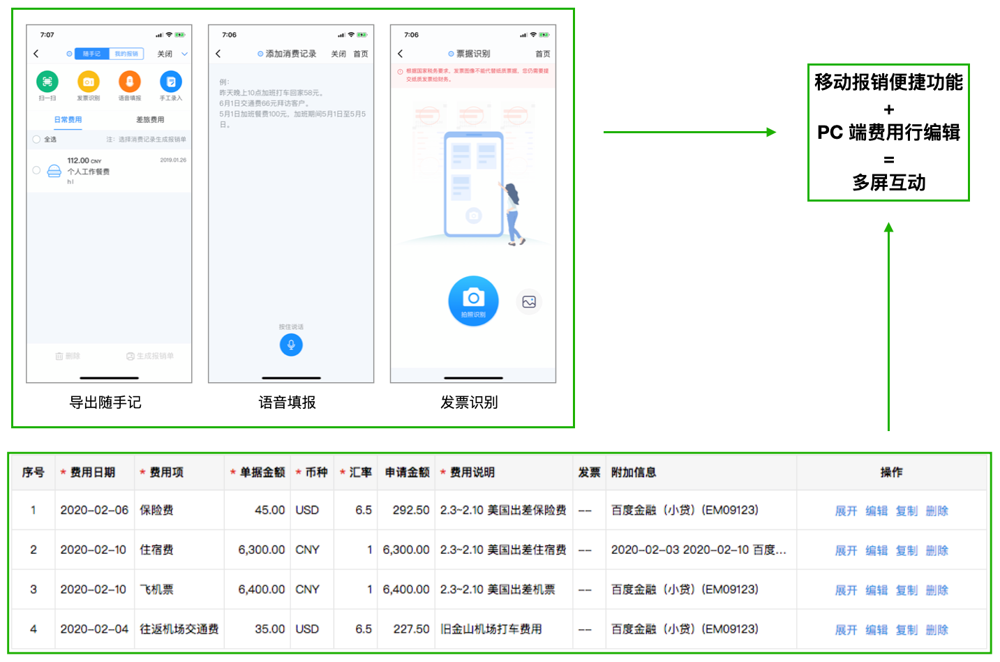

# 费用报销系统多屏互动的实现

本文为[费用报销系统展开表格行的实现](https://youknowznm.github.io/blogs/费用报销系统展开表格行的实现)的后续.

## 需求

公司即时通讯 Hi app 内嵌的移动报销 web 应用, 可提供:

- 导出随手记, 语音填报, 发票识别等功能
- 可以智能生成费用行, 自动上传并使用发票

PC 端报销应用则提供:

- 细粒度的编辑功能

将二者结合起来, 可进一步优化流程效率和用户体验.



引出需求:

- 移动端和 PC 端均有一个费用明细列表, 均可支持以每行为单位进行增/删/改
- 一端操作后, 另一端可自动更新, 并且 PC 端收到改动需以动画效果呈现, 称之为多屏互动

我负责了方案的梳理和 PC 端的实现.

## 方案和实现

PC 端/移动端成功进行了增/删/改, 通知了服务端, 服务端要**主动**通知到移动端/PC 端.  
有双向通讯的需求, 用 WebSocket, 不用轮询, 关于前者优点的文章很多, 此处不展开.

方案核心是维护一个前端的 socket 处理器模块.

用户通过 UI 开启多屏互动,

先从远端获取指定的 socket 服务 URL 并连接; 同时获取 Hi 端移动报销对应报销单页面的短链接, 生成二维码,

用户扫码连接, 开始移动端的编辑;

移动端更新成功后, 远端会通知 socket 服务, socket 处理器收到信息.

建立 socket 连接的同时会开始 10s 一次的心跳检测, 未收到回应(如页面意外关闭)或者在一端手动退出, 则两端均退出多屏互动.

## 通信内容

一端更新成功后, 要通知另一端以下的数据:

1. 消息类型, 可能为增/删/改或某种 UI 交互
2. 数组增删改的具体项

- 哪一行被更新了
- 更新了哪些内容

3. 上次任意一端修改成功的时间戳, 用以避免两端数据改动未同步的情况

受限于后端, 前端只能一次获取**整个表格**而无法直接得到更新了的行的内容. 因此(2)中的两部分均以 socket 消息告知, 后端提供*
*增/删/改了的行号**和**更新后的整个表格数组**, 其它逻辑前端处理.

> 其它业务场景中, 有可能 更新内容的标识 和 详细的更新内容 不需要同时获取:   
> 例如更新的详细内容体积过大/响应慢/只需在一定情况下获取.   
> 这种情况可以考虑只通过 socket 拿到前者, 再通过前端主动发起的 ajax 获取后者, 提高性能.

## 数据流动图示

总体的数据流动如下图.


## 难点一: 不受 react 控制的动画

如需求描述, 移动端增/删/改成功后, 该行的改动要在 PC 端以动画的形式体现. 但所使用的自研 `Table` 组件有一个缺陷:

> 其接受一个数组 prop 作为整个表格的数据, 无法观测到数组具体某一项的改动.

由于获取不到某一行的 ref, 也不能直接用 `react-transition-group` 实现动画.

收到 socket 消息后, 计算出数组中实际变动的项, 通过 `document.querySelector('[data-id=xxx]')` 获取更新的行号所对应的 DOM,
对它进行 splice:

- 对数组增加/修改项时, 先更新再动画
- 删除项时相反, 并且复用增加的关键帧

动画会产生在 `<tr>` 及其子元素上, 且同一时刻最多有一个.  
还要监听 `animationstart` 和 `animationend`, 在期间禁用表格的展开/收起/编辑等操作.

动画类的样式如下:

```scss
/* 行更新动画 */

$appended-anim-duration: .75s;
$updated-anim-duration: 1.5s;

.bill-detail-list-table .erp-table-tbody tr {
  &.updated {
    animation: updated-anim $updated-anim-duration linear;
    @keyframes updated-anim {
      0% {
        background-color: transparent;
      }
      15% {
        background-color: # #fff176;
      }
      100% {
        background-color: transparent;
      }
    }
  }

  &.appended {
    animation: appended-anim-td-wrap $appended-anim-duration;
    @keyframes appended-anim-td-wrap {
      0% {
        height: 0;
        opacity: 0;
      }
      60% {
        opacity: 0;
      }
      100% {
        height: auto;
        opacity: 1;
      }
    }

    td {
      animation: appended-anim-td $appended-anim-duration;
      @keyframes appended-anim-td {
        0% {
          height: 0;
          padding-top: 0;
          padding-bottom: 0;
        }
        60% {
          transform: scale(1.5);
        }
        100% {
          height: 42px;
          padding-top: 12px;
          padding-bottom: 12px;
        }
      }
    }

    div {
      animation: appended-anim-div $appended-anim-duration;
      @keyframes appended-anim-div {
        0% {
          height: 0;
        }
        100% {
          height: 17px;
        }
      }
    }
  }

  &.removed {
    height: 0;
    border: 0;
    opacity: 0;
    animation: appended-anim-td-wrap $appended-anim-duration reverse;

    td {
      height: 0;
      padding-top: 0;
      padding-bottom: 0;
      animation: appended-anim-td $appended-anim-duration reverse;
    }

    div {
      height: 0;
      animation: appended-anim-div $appended-anim-duration reverse;
    }
  }
}
```

## 难点二: PC 端编辑某行时, 移动端发生更新的处理

多屏互动时数据数组的改动来源有两个: socket
信息和[之前提到的行内编辑器](https://youknowznm.github.io/blogs/费用报销系统展开表格行的实现).  
对这两种来源的协同处理也是技术难点之一.

PC 端编辑某行时, 移动端也对某行进行了增/删/改, 有十种左右的可能场景. 总结为:

1. 移动端修改了 PC 端正在编辑的行, 需要用户确认保留哪份数据
2. 移动端删除了 PC 端正在编辑的行, 提示并移除当前行
3. PC 端编辑某行, 移动端增/删: 更新后重新计算被编辑行的索引, 并恢复之前编辑的内容