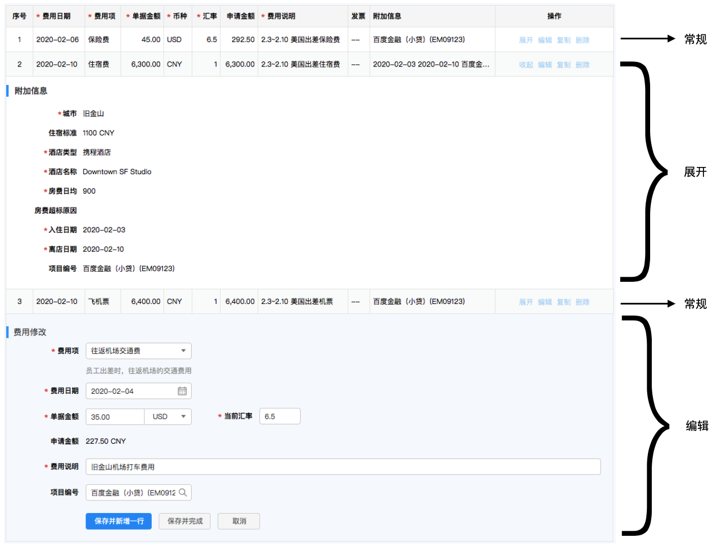
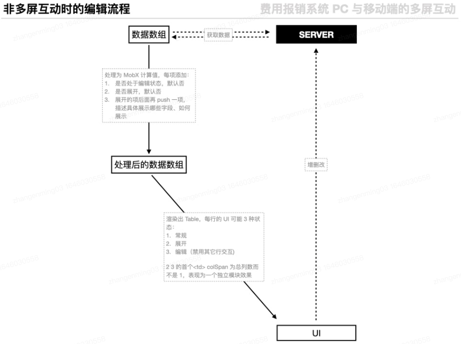

# 费用报销系统展开表格行的实现

## 需求

费用报销 PC 端系统有一个费用明细列表, 其支持行内的详情编辑和展开/收起类的交互, 如图:

## 核心实现

从远端获取并初始化数据数组, 将其处理为一个 mobx 计算值 `computedList`:

- 每项额外维护是否编辑和是否展开的状态
- 展开的项后面再推入一项, 描述具体展开了哪些字段, 如何展示

`Table` 组件的关键 prop:

- `data` 描述行内容, 不使用后端给的原始数组, 而用上述的 `computedList`
- `columns` 描述列, 首列内容是动态的:
- 展开或编辑时, tdProps 值为列的总数, 已实现占满整行的视觉效果

增删改成功后更新原始数组, 同时更新 `computedList` 和 UI.

数据流动如图:

## 详细实现

每行的操作列有 4 个按钮:

1. 展开

- 表格数据由后端以一整个数组的形式提供, 但这里有一个'展开行'的需求(如图中的第 2 行), 所以前端给数组每项添加一个
  `isCollapsed` 属性, 在展开/收起时修改它
- 同时, Table 的 `data` prop 并不是原始数据而是 computed 出的新数组 `computedList`, 特点是每个已展开的项 A 后面会再 push
  项 B(其内容是项 A 的'附加信息',
  同时以 `isDetailLine` 和 A 区分开)

2. 编辑

- 维护一个 `editedLineIndex`, 当某行的索引和它相等时, 认为该行是一个编辑器, 其它行的操作按钮均被禁用
- 编辑器行有特殊的样式和可编辑的 UI
- 编辑某行时, `editedLineIndex` 为该行的索引
- 新增行时, 向数组推入一个全部属性为默认值的项, 再改写 `editedLineIndex` 为这一项的索引
- 成功保存后, 重置 `editedLineIndex` 为 -1; 保存失败或取消新增时, 重置, 再从数组里移除该项
- **处于展开/编辑状态下的行, 在 Table 的 `columns` prop 数组中对应项的 `tdProps` 为列的总数而不是 1, 来达到首列占满整行的效果
  **

3. 复制

- 通知后端要复制的行的 id, 根据响应结果, 计算出新的 `computedList`, 更新表格

4. 删除

- 对新增状态(未持久化)的行, 弹窗确认后直接从数据数组中移除即可
- 删除已持久化的行, 在调接口之后从数组中移除